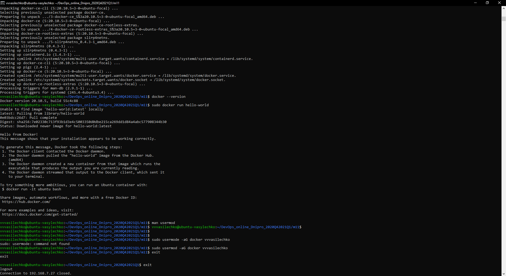
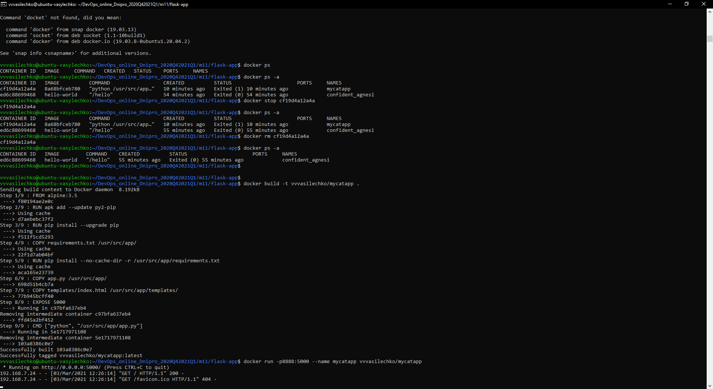
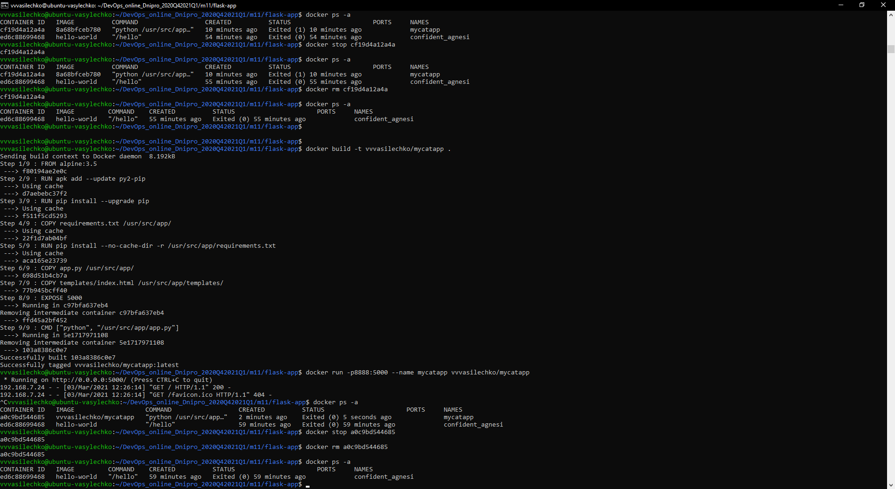
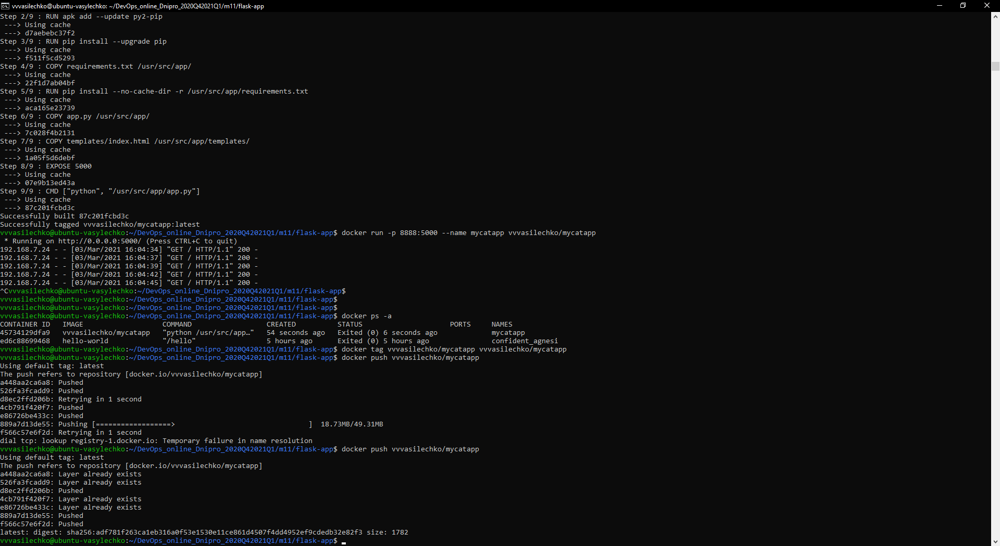
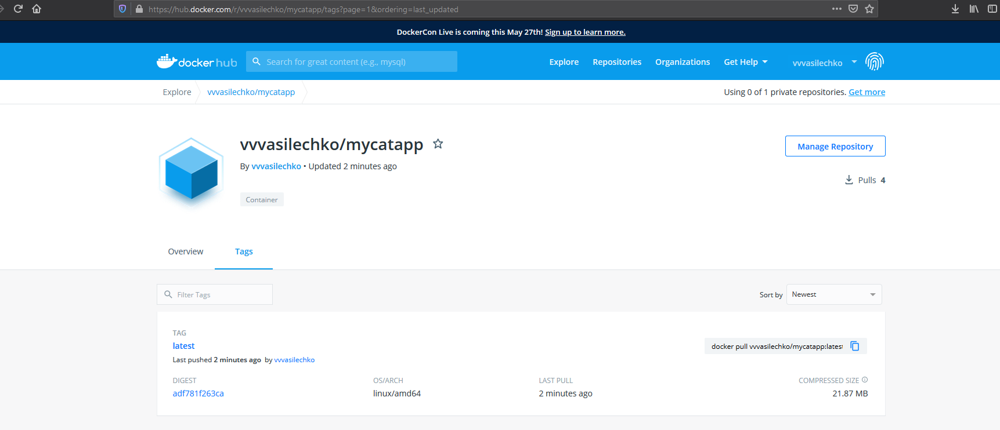

# TASK 9.3 #

1.  
  
Pic.1.  
Installing Docker.  

2.  
  
Pic.2.  
Building in starting Docker.  

3.  
  
Pic.3.  
Result. HTML page with random cat images.  

4.  
  
Pic.4.  
Stop and delete docker image.  

5.  
  
Pic.5.  
Push image to hub.docker.com.  

6.  
  
Pic.5.  
Mycatapp on hub.docker.com.  

