# TASK 5.2 #
------
  
Pic.1.  
Pseudo users have shell /usr/sbin/nologin often. UID range 0-65535, is the third field in file /etc/passwd.  
ROOT ID always 0. Services ID 1-999. Users ID 1000-65534.  

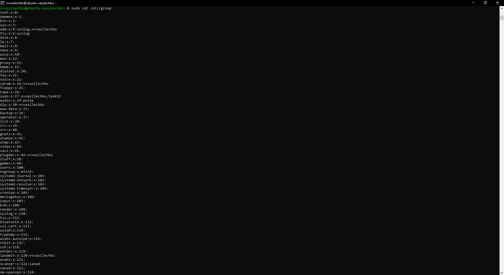  
Pic.2.  
The GID is group ID, is the third field in file /etc/group.  

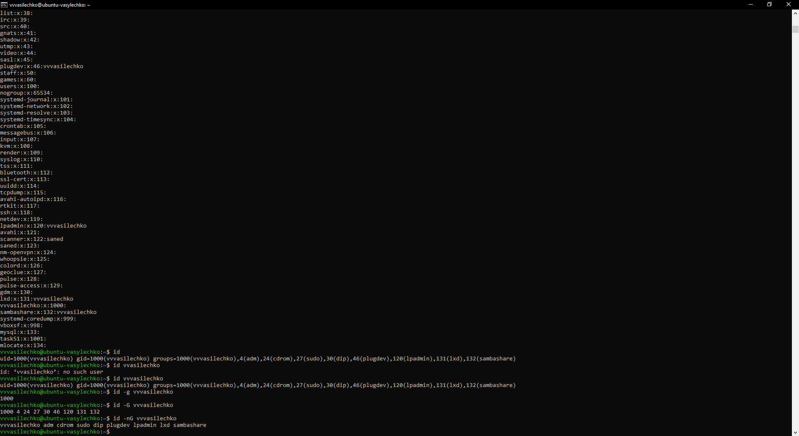  
Pic.3.  
User and his group.  

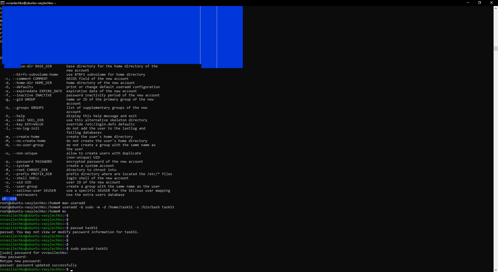  
Pic.4.  
Add user to the system.  

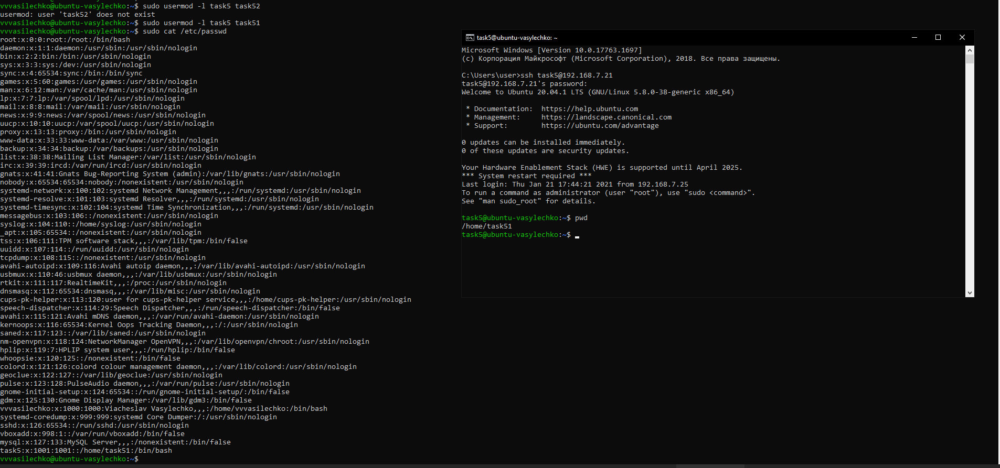  
Pic.5.  
Change user name.  

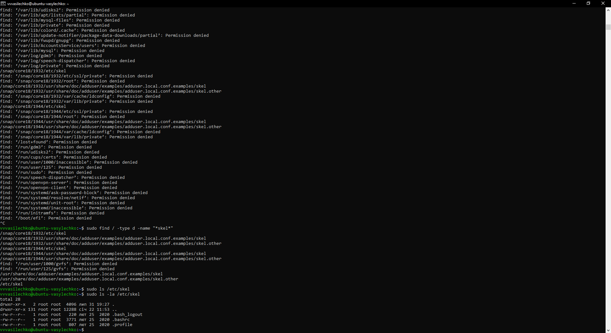  
Pic.6.  
Skel directory.  

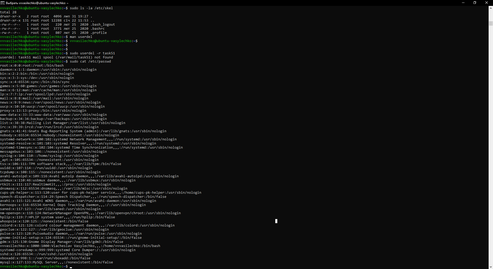  
Pic.7.  
Delete user and his mailbox (if exist in default directory).  

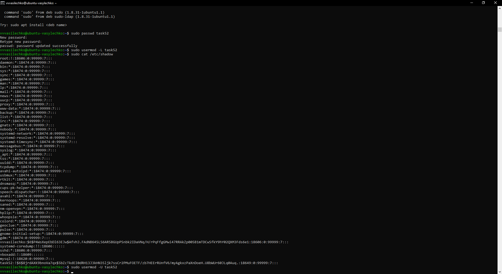  
Pic.8.  
Lock and Unlock user with usermod command.  

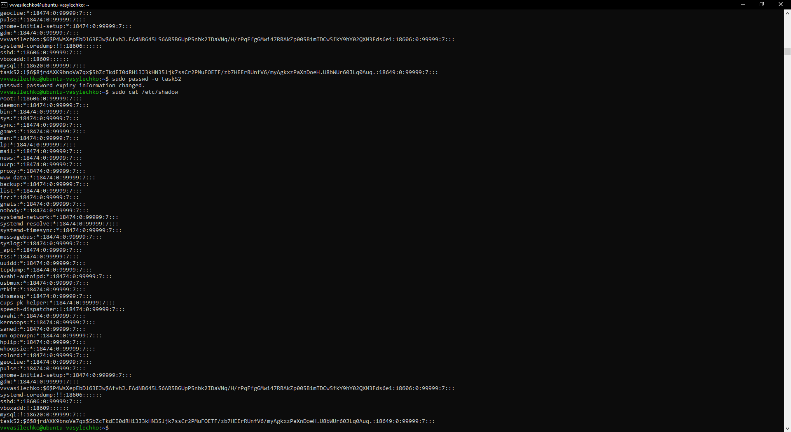  
Pic.9.  
Lock and Unlock user with passwd command.  

  
Pic.10.  
Remove user password.  

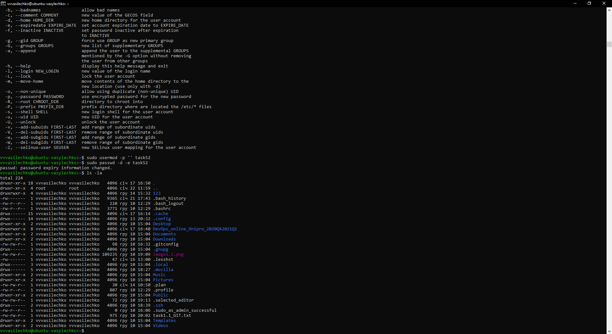  
Pic.11.  
Information about directory.  
Rights, hasrd link, user owner, group owner, size, last modified, name (file,dir).   

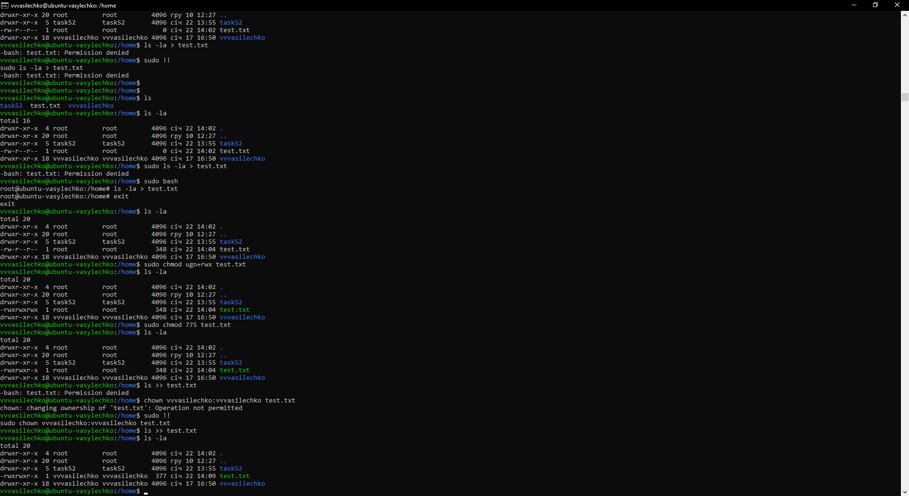  
Pic.12.
Chmod and Chown.  
Umask is set permitions for new files (directories) by default.  
Sticky bit disable delete files in directory if user is not owner fo file.  

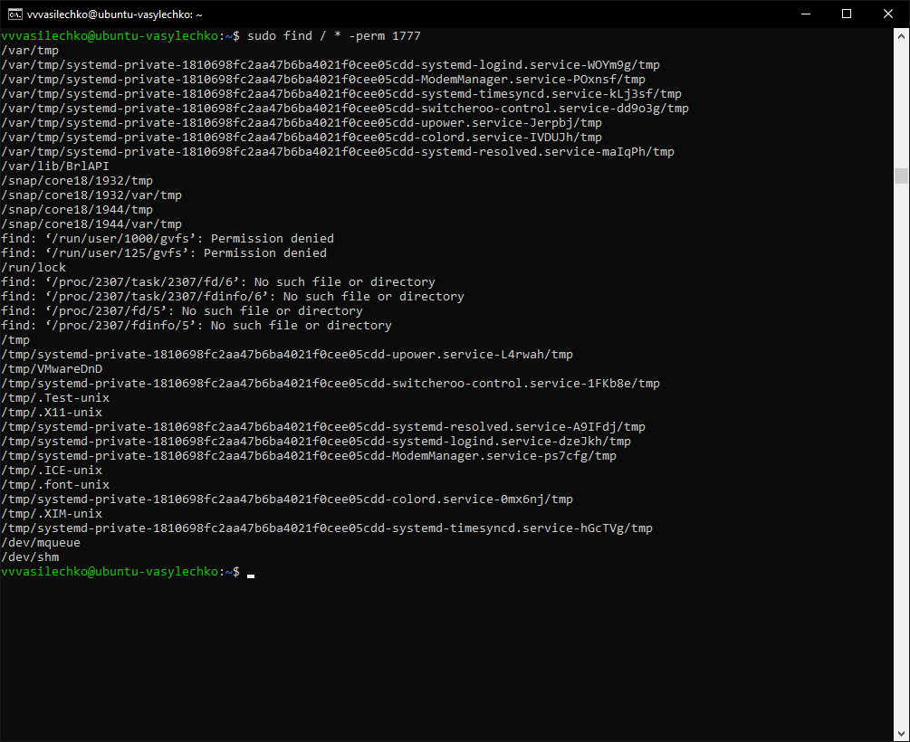  
Pic.13.  
Directories with Sticky bit.  
