# TASK 5.3 #

### TASK 5.3.1 ###
------
1. A process in Linux has 5 states: R - running, T - stopped, Z- zoombi, S - sleeping (waiting), D - uninteraptable sleeping (usually waiting I/O).  

2.  
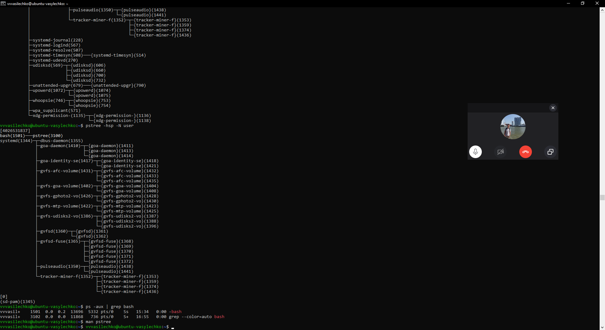  
Pic.1.  
pstree command.  

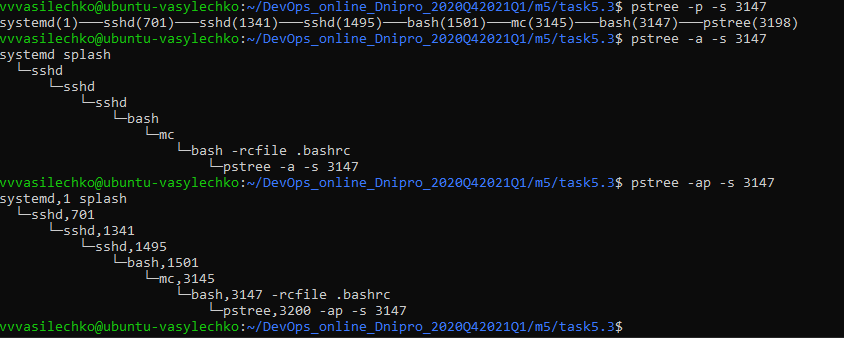  
Pic.2.  
pstree command with current process.  

3. Proc is getting information from kernel about processes.  

4.  
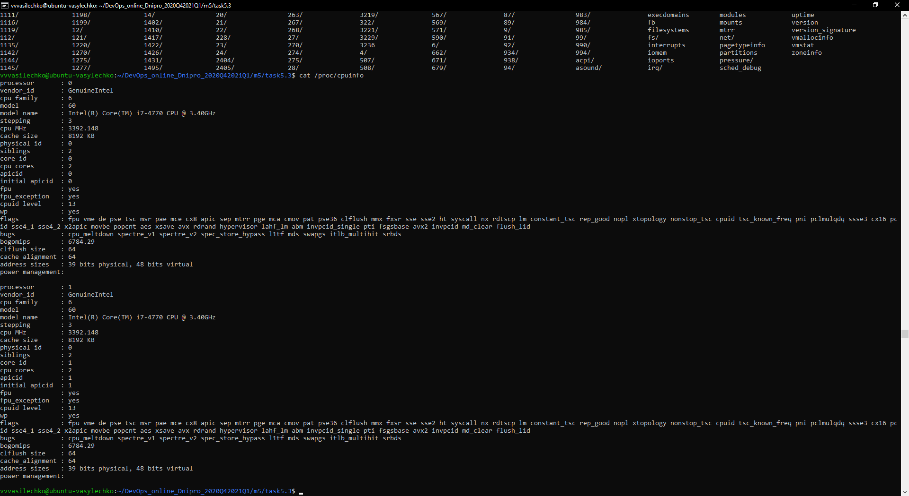  
Pic.3.  

5.  
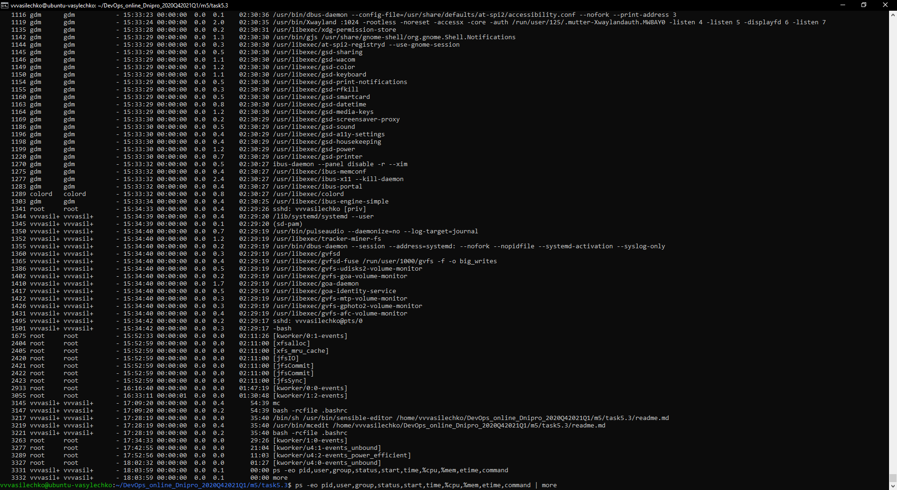  
Pic.4.  
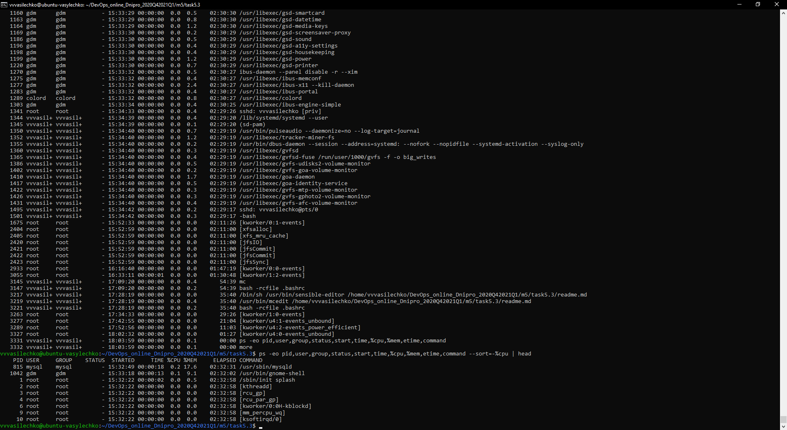  
Pic.5.  

6.  
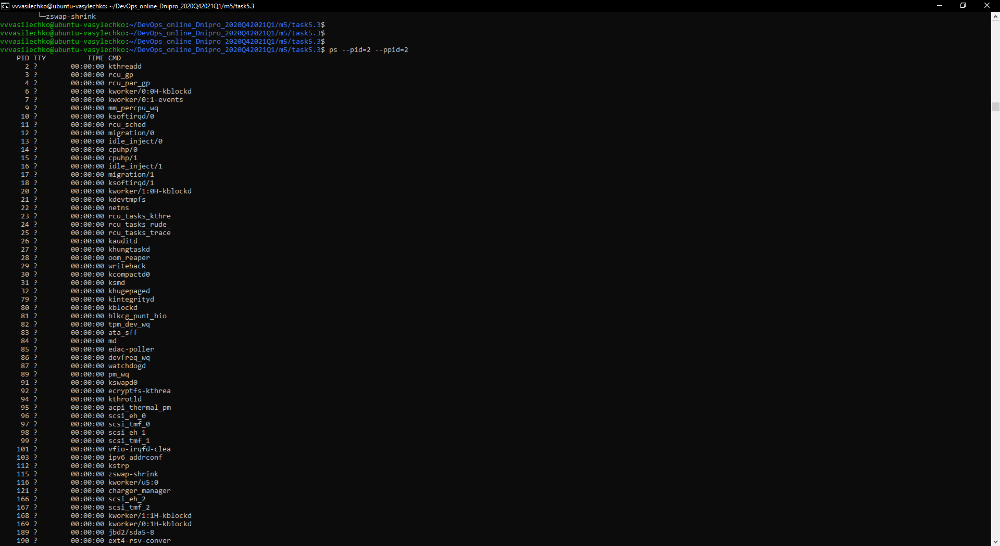  
Pic.6.  
Kernel processes.  
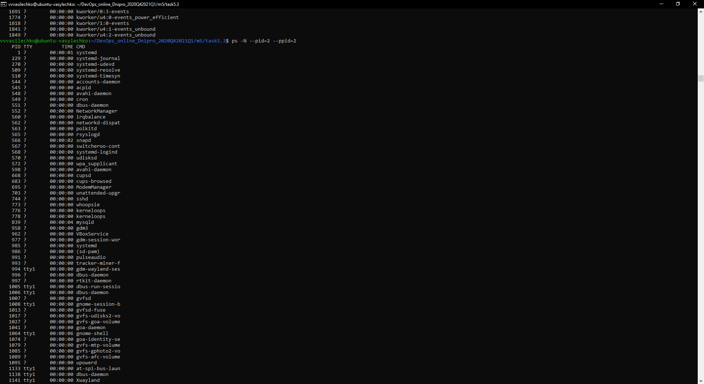  
Pic.7.  
User processes.  

7.  
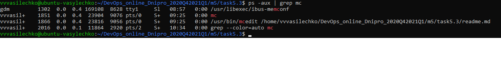  
Pic.8.  
Grep process mc. It has status S+. The process is sleeping and working in foreround  

8.  
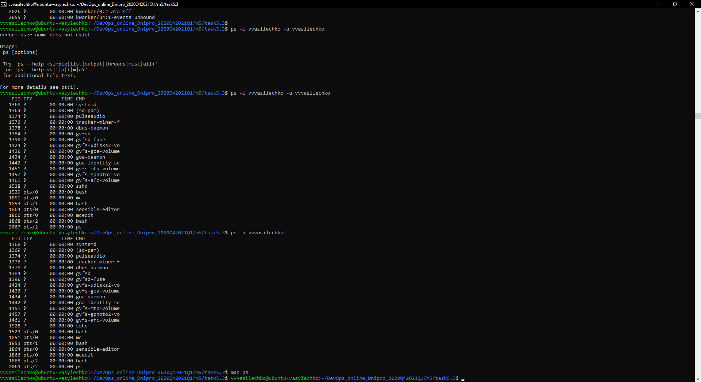  
Pic.9.  
Processes of specific user.  

9.  
The utils top and pstree also can be used to see the processes.  

10.  
The TOP showes PID, user, load CPU and Memmory, processes, nice and uptime of processes.  

11.  
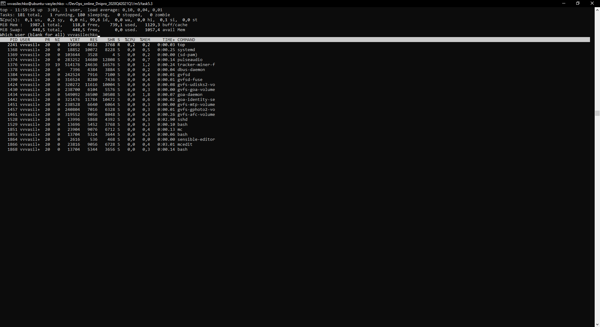  
Pic.10.  
The processes of my username (vvvasilechko).  

12-13.  
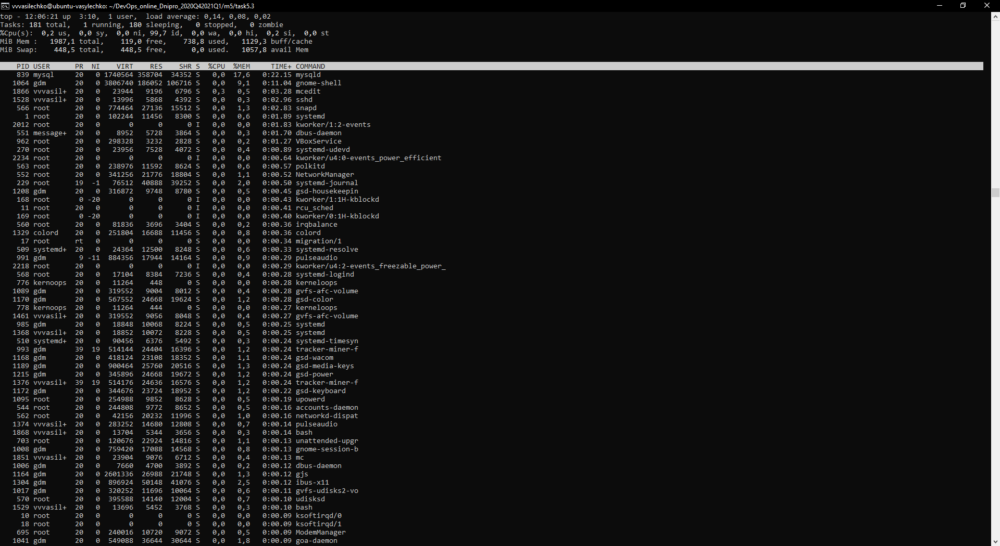  
Pic.11.
Top. Sort by Time of process(Shift+T).  
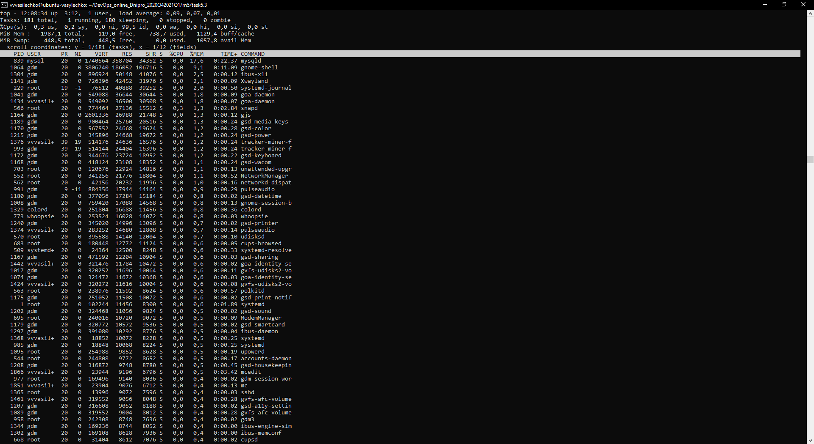  
Pic.12.
Top. Sort by usage Memmory by process(Shift+M).  
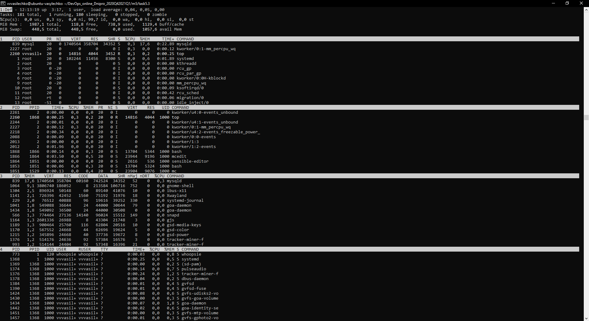  
Pic.13.
Top. Multi window(Shift+A). Keys "a" and "w" to switch between windows top.  

14.  
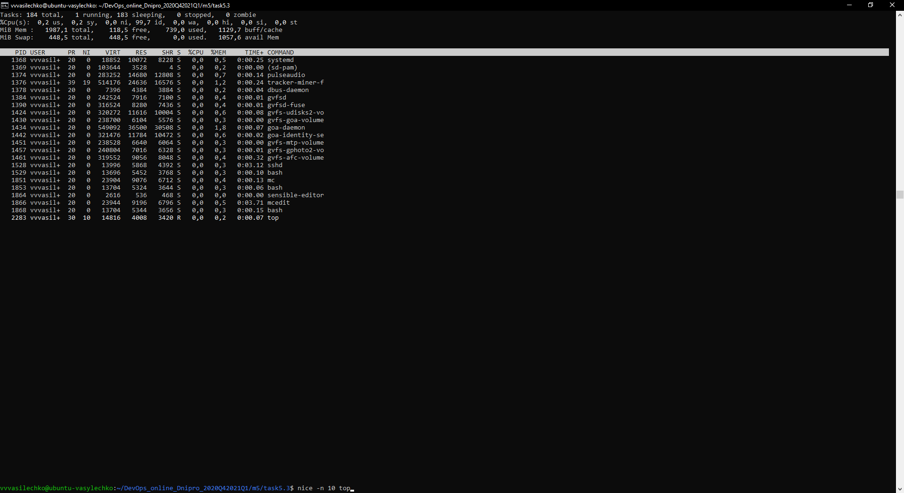  
Pic.14.  
Set priority by "nice".  

15.  
  
Pic.15.  
Set priority by top. Enter key "r". Enter PID process, than enter new priority.  

16.  
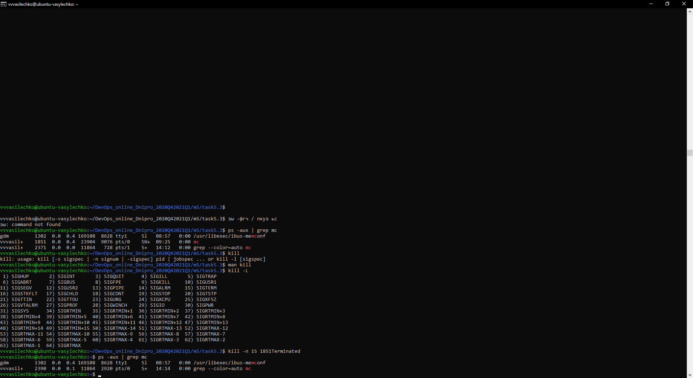  
Pic.16.  
Kill mc.  

17.  
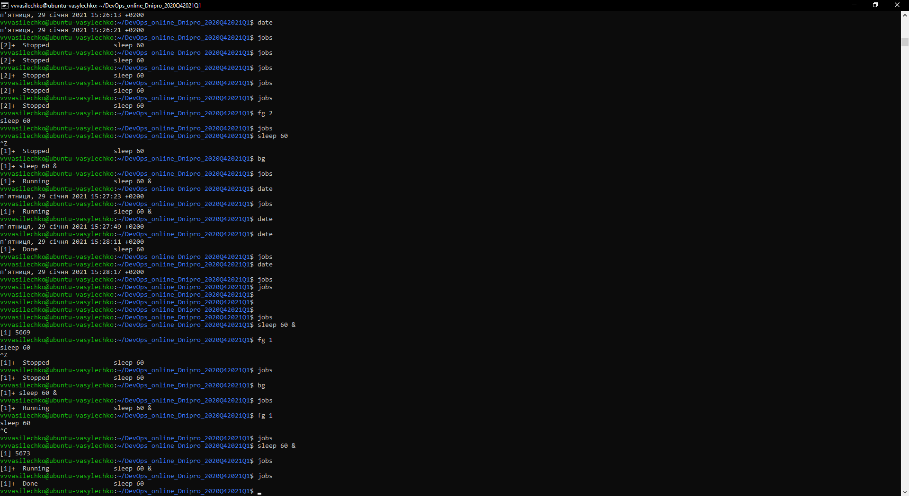  
Pic.17.  
Jobs, fg, bg.  

18.  
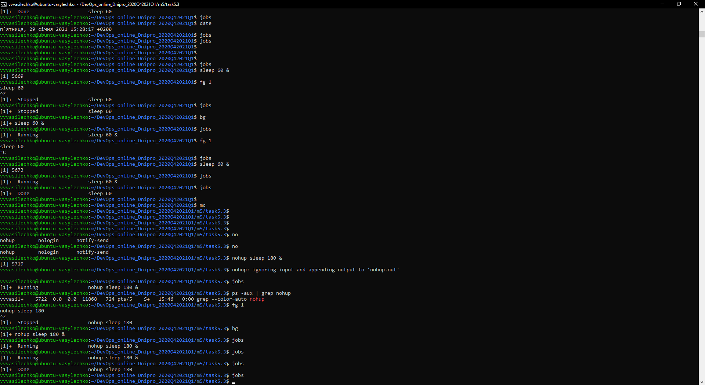  
Pic.18.  
Nohup.  

### TASK 5.3.2 ###
------

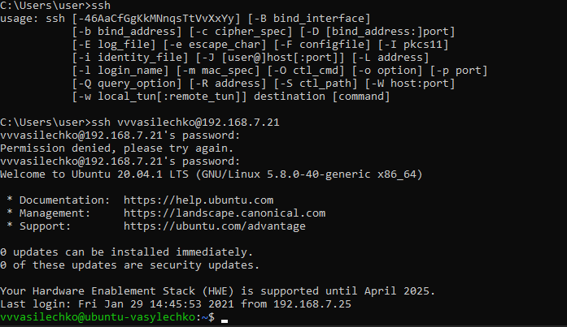  
Pic.18. SSH login from cmd.  

