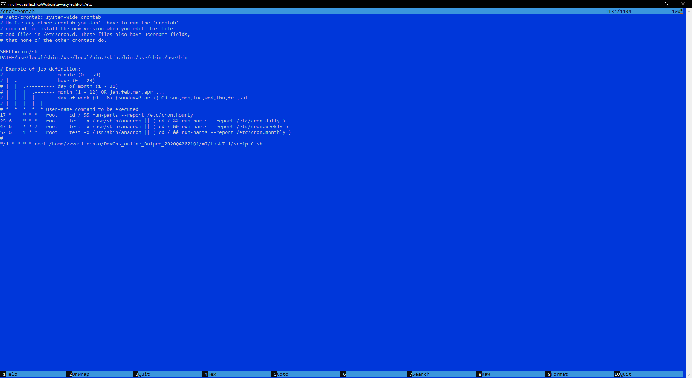

# TASK 7.1 #

### A ###

ScriptA.sh is working with:
- --all parameters;
- --target parameters;
- no parameters.

### B ###

ScriptB* is doing:
- ScriptB1 gets from which IP address were the most requests;
- ScriptB2 gets most requested pages;
- ScriptB3 counts requests from each IP;
- ScriptB4 outputs mom-existent pages;
- ScriptB5 gets time when were most requests;
- ScriptB6 find bots.

### C ###

  
Pic.12. ScriptC.sh creates backup some directory with log file. Script starting by cron.

